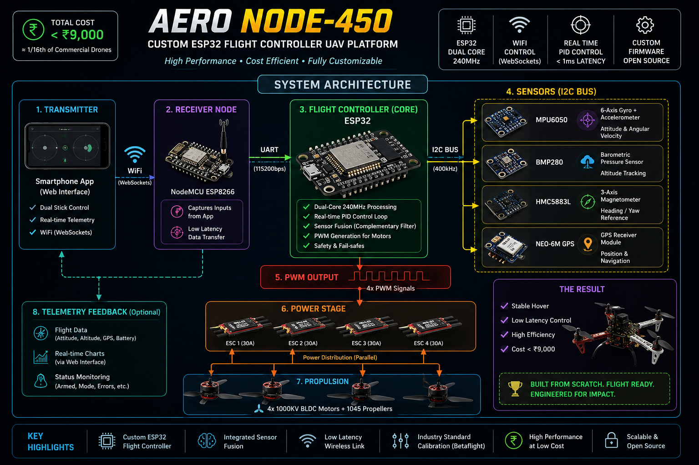

<!-- AERO NODE-450 | GitHub README -->

<div align="center">


# ⬡ AERO NODE-450

### `ESP32-BASED AUTONOMOUS QUADCOPTER PLATFORM`


</div>

---

<p align="center">
  
</p>

## `01` ◈ MISSION PARAMETERS

| PARAMETER | VALUE |
|:---|:---|
| 💡 **Innovation** | Custom Flight Controller — built from scratch on ESP32 |
| 💸 **Build Cost** | `< ₹9,000` — approx. 1/16th of equivalent market drones |
| ⚡ **Performance** | Real-time PID loop · low-latency sensor fusion |
| 📡 **Control Link** | WiFi via WebSockets (ESP8266 receiver node) |
| 🧠 **Tech Domain** | Embedded Systems · IoT · Control Systems · UAV Engineering |
| 🎯 **Outcome** | Fully functional, flight-tested quadcopter |

---

## `02` ◈ SIGNAL CHAIN ARCHITECTURE

```
┌─────────────────────────────────────────────────────────┐
│                  COMMAND LAYER                          │
│   📱  Smartphone App                                    │
│        │                                                │
│        ▼  WiFi · WebSocket stream                       │
│   📡  ESP8266  ——  Wireless Receiver Node               │
│        │                                                │
│        ▼  UART serial bridge                            │
│   🧠  ESP32  ——  Primary Flight Controller              │
│        │                                                │
│        ▼  I²C · SPI sensor bus                         │
│   📊  Sensor Fusion                                     │
│       ├── MPU6050   →  6-axis IMU                       │
│       ├── BMP280    →  Barometric altitude              │
│       ├── HMC5883L  →  Magnetometer / compass           │
│       └── NEO-6M    →  GPS position lock                │
│        │                                                │
│        ▼  PWM signals → ESCs                           │
│   ⚡  BLDC Motors ×4  ——  Propulsion Array              │
└─────────────────────────────────────────────────────────┘
```

---

## `03` ◈ COST VS MARKET BENCHMARK

```
AERO NODE-450   ██░░░░░░░░░░░░░░░░░░░░░░░░░░░░░░   ₹ 9,000
DJI Mini equiv  ████████████████████████████████   ₹ 1,44,000

                └──── 94% cheaper. Same flight capability. ────┘
```

---

## `04` ◈ COMPONENT STACK

| LAYER | COMPONENT | FUNCTION |
|:---|:---|:---|
| 🧠 Brain | `ESP32` | PID loop · sensor fusion · flight control |
| 📡 Receiver | `ESP8266` | WiFi WebSocket gateway · UART relay |
| 🎯 IMU | `MPU6050` | 6-axis orientation tracking |
| 🌍 Altimeter | `BMP sensor` | Barometric altitude hold |
| 🧭 Compass | `HMC5883L` | Heading lock · direction stabilization |
| 🛰️ GPS | `NEO-6M` | Position fix · autonomous navigation |
| ⚡ Propulsion | `BLDC + ESCs` | 4-motor PWM-controlled thrust |
| 🛠️ Frame | `F450` | 450mm carbon-fibre chassis |

---

## `05` ◈ ENGINEERING DESIGN HIGHLIGHTS

**▸ Noise Suppression**
Soft-mounted controller with vibration isolation reduces IMU noise floor for tighter PID convergence and smoother flight.

**▸ Power Architecture**
High-current ESC rails isolated from MCU supply rail. Stable 3.3 V regulation maintained under full motor load.

**▸ EMI Mitigation**
GPS and magnetometer physically separated from power traces. Compass accuracy improved significantly by eliminating interference.

---

## `06` ◈ CALIBRATION PIPELINE

```
[ ACCELEROMETER ]  →  Level stability
[ MAGNETOMETER  ]  →  Direction accuracy
[ ESC SYNC      ]  →  Motor throttle alignment
        │
        ▼
[ STATUS: ARMED · READY TO FLY ✓ ]
```

---

## `07` ◈ CAPABILITY SIGNALS

```
[✓]  Flight controller built from scratch — zero off-the-shelf autopilot stack
[✓]  Multi-sensor real-time fusion: IMU · GPS · barometer · compass
[✓]  Low-latency wireless control via WebSocket protocol over WiFi
[✓]  Industry-grade outcome achieved at 1/16th the commercial cost
[✓]  Full hardware-software co-design: embedded firmware + control algorithms
```

---

## `08` ◈ DEVELOPMENT ROADMAP

```
◈ AI-based adaptive stabilization
◈ Computer vision obstacle avoidance
◈ Long-range RF control module
◈ Autonomous waypoint flight modes
```

---

## `09` ◈ VISUAL PROOF

| Build | Setup |
|:---:|:---:|
|  |  |

> *(Replace image paths with your actual media)*

---

<div align="center">

---

**VAISHNAVI**
`ECE (IoT) ENGINEER  ·  UAV + AI SYSTEMS`

---

*`// AXIOM: Powerful systems don't require expensive hardware. They require first-principles thinking.`*

</div>

